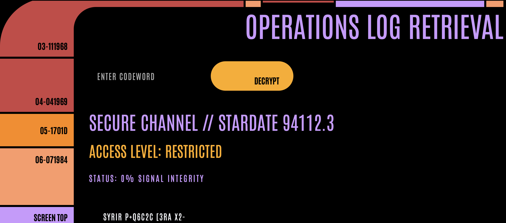
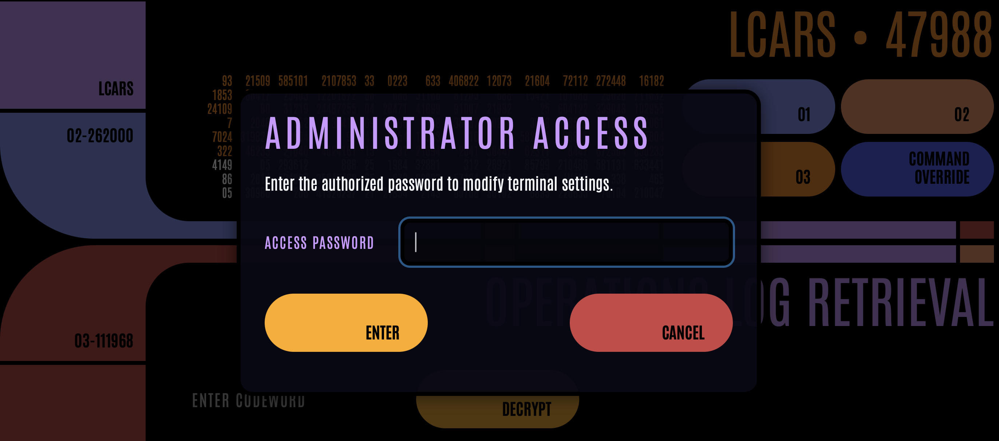
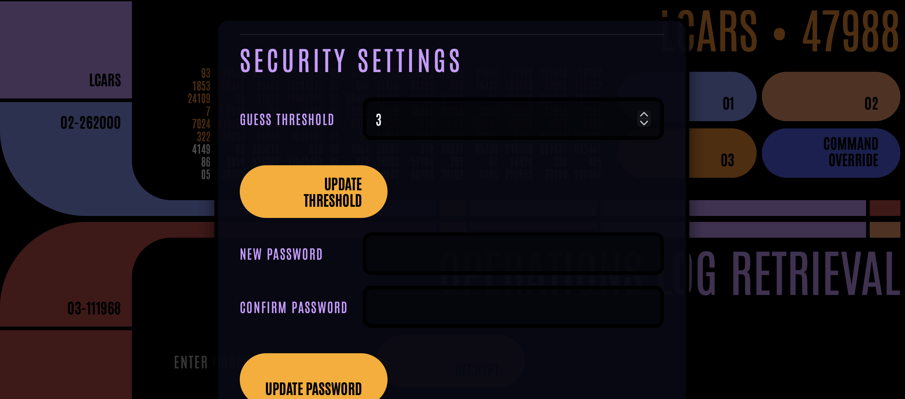
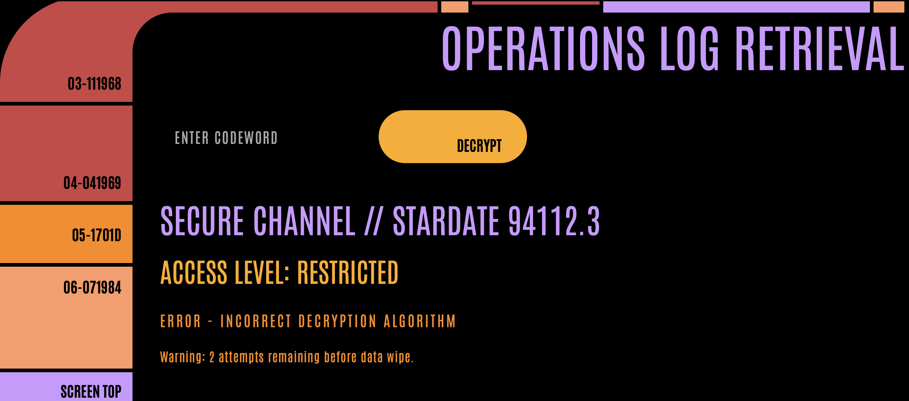

# LCARS Log Terminal

A single-page LCARS-styled terminal that supports the [Star Trek Adventures](https://modiphius.net/collections/star-trek-adventures?srsltid=AfmBOooCoFuGVTGjqgMaIfW9LXmJtZOB1y8HX25g7RshQ6ByEpOPMGmo) tabletop RPG. The interface loads `log.html`, scrambles the contents, and reveals words as operators enter approved code phrases—perfect when you want players to decipher an encrypted log for clues.

## Features

- Presents the reference LCARS layout (`classic-standard.html`) with a dedicated operations log pane.
- Accepts secure code phrases (defaults: `warp`, `transporter`, `phaser`, `klingon`):
  - `warp` reveals ~25% of remaining words.
  - `transporter` reveals ~50% of remaining words.
  - `phaser` decrypts the full log at once.
  - `klingon` triggers a terminal wipe and marks the log unrecoverable.
- Each code can be used only once per session; guesses persist between refreshes.
- Wrong or re-used codes surface an error without revealing additional content and display the remaining attempts before a wipe.
- The terminal remembers its decryption state via local storage and a session cookie, so manual refreshes do not reset progress.
- Includes LCARS audio feedback on each action.
- Administrator mode (default password `ENGAGE`) allows you to edit log entries, adjust code phrases, change the guess threshold, update the admin password, or reset everything back to the default configuration.
## Guidelines

- Keep usage non-commercial in accordance with the [TheLCARS.com license](https://www.thelcars.com/license/).
- Do not combine these assets with other web templates or distribute the LCARS resources without attribution.
- Remember to run `npm install` to set up the build tooling if you plan to regenerate `assets/terminal.js` from `assets/terminal-modern.js`.
- Use `npm run build` (see Development Notes) to regenerate the transpiled script after modifying `assets/terminal-modern.js`.


## Deployment

- For simple hosting, place the project on any static web server (GitHub Pages, Netlify, Apache, etc.).
- If you change `assets/terminal-modern.js`, regenerate the bundle with `npm install` followed by `npm run build` before deploying.
- Upload all files (including the `assets` directory and generated `assets/terminal.js`).

## Usage

1. Serve the project from the repository root, for example:
   ```bash
   python -m http.server 9191
   ```
2. Open the terminal in your browser: `http://localhost:9191/lcars-terminal.html`.
3. Enter code phrases into the field and press **DECRYPT** to progressively restore the log.
4. Select **COMMAND OVERRIDE** to manage settings (default password: `ENGAGE`).
5. Use **Reset To Defaults** in admin mode when you want to restore the starter configuration (codes reset to `warp`/`transporter`/`phaser`/`klingon`, password `ENGAGE`, guess limit 3, and only the default log).
### Suggested Tabletop Flow

- Use the terminal when you want the crew to interrogate a scrambled log for mission clues.
- Ask players to roll for Data/Science (or a relevant combo).
  - **1 success** → provide the 25% code phrase.
  - **2 successes** → provide the 50% code phrase.
  - **3+ successes** → provide the 100% code phrase.
  - **Complication (20)** → trigger the wipe code to simulate security countermeasures.
- Enter the appropriate code into the interface on behalf of the players or let them do it at the table.


### Screenshots






## Container Deployment

The repository includes a Dockerfile and compose definition that fetch the most recent published files from GitHub each time the container starts.

### Using Docker Compose

1. Build and launch the stack (the build step only needs to run when the Dockerfile changes):
   ```bash
   docker compose up --build
   ```
2. Open `http://localhost:9191/lcars-terminal.html` once the container reports that it is serving on port 9191.
3. Stop the stack with `Ctrl+C` or `docker compose down`.

### Using plain Docker

1. Build the image locally:
   ```bash
   docker build -t lcars-terminal .
   ```
2. Run the container, mapping the app port to your host:
   ```bash
   docker run --rm -p 9191:9191 lcars-terminal
   ```
   The container clones the latest `master` branch on startup; set `REPO_BRANCH` or `REPO_URL` to override the source, e.g. `docker run --rm -e REPO_BRANCH=develop -p 9191:9191 lcars-terminal`.

### Testing Local Changes

To serve your workspace files without cloning from GitHub, use the provided override compose file:

```bash
 docker compose -f docker-compose.yml -f docker-compose.local.yml up --build
```

The override mounts the current directory into the container and sets `SKIP_CLONE=1`, so any edits you make locally are reflected immediately. Stop the stack with `Ctrl+C` or `docker compose down`.


## Development Notes

- The layout and styling rely on the assets provided with `classic-standard.html`; please keep those files unchanged to preserve the LCARS look.
- The decrypt logic, state persistence, and administrator tooling live in `lcars-terminal.html` and run entirely client-side.
- Decryption progress, administrator settings, and custom logs are stored in the browser (local storage plus a cookie); clearing site data resets the experience.

## LCARS Template License

This project customises the LCARS Inspired Website Template provided by [TheLCARS.com](https://www.thelcars.com/license/). By cloning or using this repository you agree to the following non-commercial EULA terms from the template author:

- The template and any derivative works remain subject to the original license; credit with a link to TheLCARS.com is required and provided in `lcars-terminal.html`.
- Use is permitted for personal, non-commercial projects only. Redistribution, resale, or use to produce paid (or compensated) work for third parties is prohibited without written permission from the licensor.
- Do not combine these assets with other templates without attribution, and do not hotlink to resources on TheLCARS.com.
- The template (or derivatives) must not be used for illegal purposes.

Please review the complete terms at [https://www.thelcars.com/license/](https://www.thelcars.com/license/).

## License

Licensed under the MIT License. See [`LICENSE`](LICENSE).
